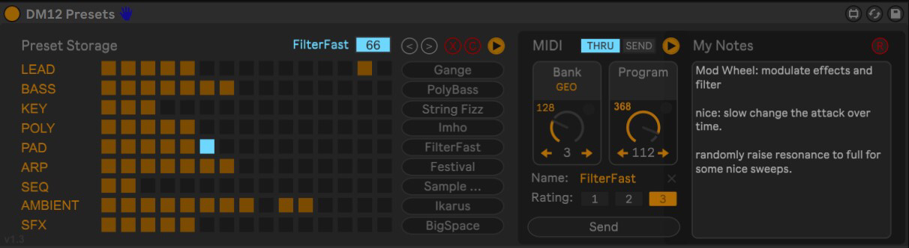

# Favorite MIDI Presets Manager

## ABOUT

__Favorite MIDI Presets Manager (FPM)__ is a Max for Live device for Ableton Live to organize presets of MIDI capable instruments or devices. 

## FEATURES

- Select Bank and Program.
- Switch between automatically or manually sending MIDI data to your MIDI device if Bank/Program is changed
- MIDI preset may have optionally a user definable name
- MIDI preset can be rated
- Select a bank and preset using incoming MIDI CC messages (configurable)
- Store and recall of favorite presets in 10x16 matrix
- Favorite presets can be organized on row level where each row has a user-definable label, eg. for different sound styles or status of a presets.
- Last selected favorite preset is preserved per row and can be recalled later.
- Recalled presets are automatically send to your MIDI device if Autosend is enabled.
- Clearing of all favorite presets.
- MIDI preset section can be hidden in case recalling of fafovite presets is needed only.
- Presets can be rated from 1-3. 
- If MIDI is send to a MIDI device an indicator blinks for a short time.
- Continious program counter is shown for devices that have them.
- Select next/previous slot in slot storage.
- Banks can have user-definable name.
- The favorite preset slot, bank and program are MIDI mappable,

## ROADMAP

## CONTRIBUTING

## RELEASES

### v1.1

- Presets are now stored with your Ableton project or you can save it as a normal Abletone device preset (.adv files). Preset slots are automatically restored.
The code is based on https://maxforlive.com/library/device/4286/mikado-base-save-patch-preset-with-live-projet. SPECIAL THANKS to spiralune for this really useful hack.

### v1.2

- NEW: Presents can be rated from 1-3
- NEW: AUTO turned on will automatically send MIDI data to your MIDI device if Bank/Program is changed
- NEW: MIDI send indicators
- NEW: MIDI CC/PGM can be filtered via switch
- NEW: Linear Program Counter
- NEW: Select next/previous slot in slot storage
- NEW: Save last selected slot per category with name for quick recall
- NEW: Clear data in a row
- NEW: MIDI IN data will now change Bank and Program
- CHANGE: Slot storage size changed to 15x9
- CHANGE: Some visual tweaks here and there
- CHANGE: Some devices required Sub-Bank instead of Bank. Both are now set to equal value. 
- BUGFIX: Bank selection now working

### v1.3

- Added a selectable bank size that is used to calculate the Linear Program Counter (bank size * program number).
- Banks can now have a user definable name
- Added a mappable number field for the currently selected slot.
- Added a field showing the current selected preset name that of the select preset slot.
- Some UI tweaks

### v1.4

- Added a section to take notes. 
- Renamed 'Auto' to 'Send'
